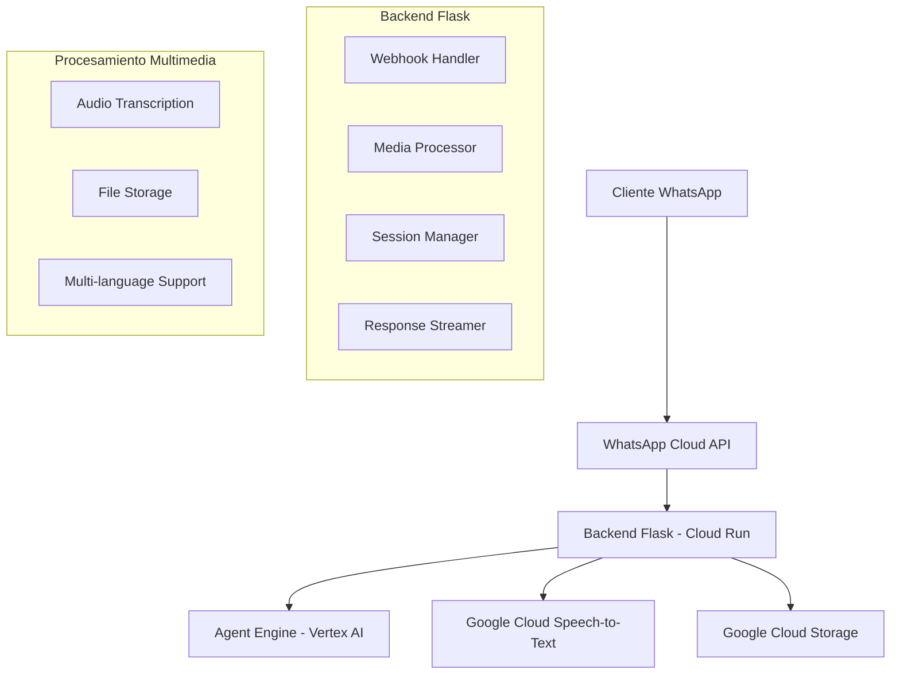
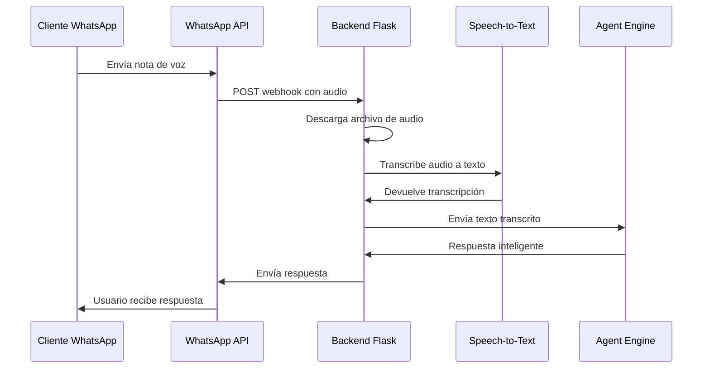

# 🤖 Agent Engine WhatsApp Business Integration

## 📋 Tabla de Contenidos

- [🎯 Descripción General](#-descripción-general)
- [🏗️ Arquitectura del Sistema](#️-arquitectura-del-sistema)
- [⚙️ Configuración e Instalación](#️-configuración-e-instalación)
- [🎵 Funcionalidades Multimedia](#-funcionalidades-multimedia)
- [🚀 Despliegue en Google Cloud](#-despliegue-en-google-cloud)
- [🧪 Pruebas y Verificación](#-pruebas-y-verificación)
- [📊 Optimizaciones Realizadas](#-optimizaciones-realizadas)
- [🔧 Monitoreo y Logs](#-monitoreo-y-logs)
- [🛠️ Solución de Problemas](#️-solución-de-problemas)
- [🔄 Mantenimiento](#-mantenimiento)
- [🚀 Próximos Pasos](#-próximos-pasos)

---

## 🎯 Descripción General

Sistema de integración que conecta **Google Vertex AI Agent Engine** con **WhatsApp Business** para crear un agente conversacional inteligente capaz de manejar:

- ✅ **Mensajes de texto** - Conversaciones naturales
- ✅ **Notas de voz** - Transcripción automática con Google Cloud Speech-to-Text
- ✅ **Imágenes** - Procesamiento y análisis de contenido visual
- ✅ **Sesiones persistentes** - Memoria conversacional por usuario
- ✅ **Respuestas en tiempo real** - Streaming de respuestas

### 🌟 Características Destacadas

- **🎤 Transcripción inteligente**: Convierte notas de voz a texto automáticamente
- **🌍 Multiidioma**: Soporte para español (ES, CO, MX) e inglés
- **🔄 Respaldo robusto**: Manejo de errores y alternativas automáticas
- **📈 Optimizado**: Código limpio, eficiente y mantenible
- **📱 Experiencia transparente**: El usuario no nota la diferencia entre texto y voz

---

## 🏗️ Arquitectura del Sistema

### Componentes Principales



### Flujo de Procesamiento

#### 📱 **Mensajes de Texto**
```
Cliente → WhatsApp API → Backend → Agent Engine → Respuesta → Cliente
```

#### 🎤 **Notas de Voz**
```
Cliente → WhatsApp API → Backend → Speech-to-Text → Agent Engine → Respuesta → Cliente
                               ↘️ (si falla) → GCS → Agent Engine ↗️
```

#### 🖼️ **Imágenes**
```
Cliente → WhatsApp API → Backend → GCS Upload → Agent Engine → Respuesta → Cliente
```

---

## ⚙️ Configuración e Instalación

### 📋 Prerrequisitos

- **Google Cloud Project** con APIs habilitadas:
  - Vertex AI API
  - Cloud Run API
  - Cloud Storage API
  - Speech-to-Text API
- **WhatsApp Business Account** con Meta for Developers
- **Python 3.11+** (recomendado para compatibilidad)

### 🔧 Variables de Entorno

| Variable | Descripción | Ejemplo |
|----------|-------------|---------|
| `PROJECT_ID` | ID del proyecto de Google Cloud | `mi-proyecto-123` |
| `LOCATION` | Región del Agent Engine | `us-central1` |
| `AGENT_ENGINE_RESOURCE_NAME` | Identificador completo del agente | `projects/123/locations/us-central1/reasoningEngines/456` |
| `WHATSAPP_ACCESS_TOKEN` | Token de acceso de Meta | `EAAG...` |
| `WHATSAPP_VERIFY_TOKEN` | Token de verificación del webhook | `mi_token_secreto` |
| `STAGING_BUCKET` | Bucket para archivos multimedia | `mi-bucket-multimedia` |

### 📦 Dependencias

```txt
flask
flask_cors
google-cloud-aiplatform
google-cloud-speech
google-cloud-storage
python-dotenv
gunicorn
requests
python-magic
```

### 🚀 Instalación Local

```bash
# 1. Clonar repositorio
git clone <tu-repositorio>
cd Backend

# 2. Crear entorno virtual
python -m venv .venv
source .venv/bin/activate  # Linux/Mac
# .venv\Scripts\activate     # Windows

# 3. Instalar dependencias
pip install -r requirements.txt

# 4. Configurar variables de entorno
cp .env.example .env
# Editar .env con tus valores

# 5. Ejecutar localmente
python new_python_agent_backend.py
```

---

## 🎵 Funcionalidades Multimedia

### 🎤 **Transcripción de Notas de Voz**

#### Problema Resuelto
El **Agent Engine de Vertex AI** no acepta archivos multimedia directamente. Los parámetros como `contents` o `file_uris` no son reconocidos, causando errores:

```
TypeError: Runner.run() got an unexpected keyword argument 'contents'
TypeError: Runner.run() got an unexpected keyword argument 'file_uris'
```

#### ✅ Solución Implementada

**Transcripción automática con Google Cloud Speech-to-Text:**

```python
def transcribe_audio(file_path, mime_type):
    """Transcribe audio usando Google Cloud Speech-to-Text"""
    client = speech.SpeechClient()
    
    # Configuración optimizada para múltiples idiomas
    config = speech.RecognitionConfig(
        encoding=determine_encoding(mime_type),
        sample_rate_hertz=16000,
        language_code="es-ES",
        alternative_language_codes=["es-CO", "es-MX", "en-US"],
        enable_automatic_punctuation=True,
        enable_word_confidence=True,
        max_alternatives=1
    )
    
    # Realizar transcripción
    response = client.recognize(config=config, audio=audio)
    return response.results[0].alternatives[0].transcript
```

#### Flujo de Procesamiento



#### Características Técnicas

- **📄 Formatos soportados**: OGG Opus, MP3, WAV, WebM
- **🌍 Idiomas**: Español (ES, CO, MX), Inglés (US)
- **⚙️ Configuración avanzada**: Puntuación automática, confianza de palabras
- **🔄 Respaldo robusto**: Google Cloud Storage si falla transcripción

### 🖼️ **Procesamiento de Imágenes**

Las imágenes se procesan de la siguiente manera:
1. **Descarga** desde WhatsApp API
2. **Subida** a Google Cloud Storage
3. **Contexto descriptivo** enviado al Agent Engine
4. **Análisis** por parte del agente basado en la descripción

---

## 🚀 Despliegue en Google Cloud

### 🐳 **Construcción y Despliegue**

#### 1. Preparar la imagen Docker

```bash
# Construir la imagen
gcloud builds submit --tag gcr.io/[PROJECT_ID]/backend:latest . --project=[PROJECT_ID]
```

#### 2. Desplegar en Cloud Run

```bash
# Desplegar el servicio
gcloud run deploy backend \
  --image gcr.io/[PROJECT_ID]/backend:latest \
  --region us-central1 \
  --platform managed \
  --allow-unauthenticated \
  --project=[PROJECT_ID]
```

#### 3. Configurar variables de entorno

```bash
# Configurar variables de entorno en Cloud Run
gcloud run services update backend \
  --update-env-vars \
  PROJECT_ID=[PROJECT_ID],\
  LOCATION=us-central1,\
  AGENT_ENGINE_RESOURCE_NAME=[AGENT_RESOURCE_NAME],\
  WHATSAPP_ACCESS_TOKEN=[WHATSAPP_TOKEN],\
  WHATSAPP_VERIFY_TOKEN=[VERIFY_TOKEN],\
  STAGING_BUCKET=[BUCKET_NAME] \
  --region us-central1 \
  --project=[PROJECT_ID]
```

### 🔧 **Configuración de APIs**

#### Habilitar APIs necesarias

```bash
# Habilitar APIs requeridas
gcloud services enable speech.googleapis.com --project=[PROJECT_ID]
gcloud services enable aiplatform.googleapis.com --project=[PROJECT_ID]
gcloud services enable storage.googleapis.com --project=[PROJECT_ID]
gcloud services enable run.googleapis.com --project=[PROJECT_ID]
```

#### Crear bucket de staging

```bash
# Crear bucket para archivos multimedia
gsutil mb gs://[BUCKET_NAME]
gsutil iam ch serviceAccount:[SERVICE_ACCOUNT]:objectAdmin gs://[BUCKET_NAME]
```

### 🔗 **Configuración de WhatsApp Business**

#### 1. Webhook Configuration
- **URL**: `https://[SERVICE_URL].run.app/whatsapp/webhook`
- **Verify Token**: Valor de `WHATSAPP_VERIFY_TOKEN`

#### 2. Suscripción a Eventos
- ✅ `messages` - Para recibir mensajes entrantes

#### 3. Permisos y Tokens
- `whatsapp_business_management`
- `whatsapp_business_messaging`

---

## 🧪 Pruebas y Verificación

### ✅ **Pruebas de Funcionalidad**

#### Prueba de Mensajes de Texto
```bash
# Ejecutar script de prueba
python test_backend.py
```

#### Prueba de Notas de Voz
1. **Envía una nota de voz** a tu número de WhatsApp Business
2. **Verifica logs** en Google Cloud Console:
   ```
   ✅ "Audio transcrito exitosamente: [texto]"
   ✅ "Enviando audio al Agent Engine"
   ```
3. **Confirma respuesta** contextual del agente

#### Prueba de Imágenes
1. **Envía una imagen** a WhatsApp Business
2. **Verifica** subida a Google Cloud Storage
3. **Confirma** que el agente recibe contexto sobre la imagen

### 📊 **Métricas de Éxito**

- **Transcripción exitosa**: >90% de notas de voz
- **Tiempo de respuesta**: <5 segundos
- **Idiomas funcionando**: Español (CO, MX, ES) e Inglés
- **Formatos soportados**: OGG, MP3, WAV, WebM

---

## 📊 Optimizaciones Realizadas

### 🔧 **Mejoras de Código**

#### Estadísticas de Optimización
- **📉 Líneas eliminadas**: 40 líneas (-7.7% reducción)
- **🔄 Código duplicado**: 0 líneas (antes: 30+ líneas)
- **📦 Importaciones**: Eliminadas innecesarias
- **📝 Logging**: 77% menos verboso

#### Función Unificada para Eventos
```python
def extract_text_from_event(event):
    """Extrae texto de un evento del agente de forma unificada."""
    if hasattr(event, 'text') and event.text:
        return event.text
    elif hasattr(event, 'parts') and event.parts:
        return event.parts[0].text
    # ... manejo de otras estructuras ...
    return None
```

#### Beneficios
- ✅ **Mejor mantenibilidad** - Código más limpio
- ✅ **Menor complejidad** - Lógica unificada
- ✅ **Mayor eficiencia** - Menos overhead
- ✅ **Misma funcionalidad** - Sin pérdida de características

---

## 🔧 Monitoreo y Logs

### 📈 **Logs Importantes**

#### ✅ Logs de Éxito
```
INFO: Google Cloud Speech-to-Text está disponible
INFO: Audio transcrito exitosamente: [texto transcrito]
INFO: WhatsApp webhook received from [IP]
INFO: Extracted text from agent event to send via WhatsApp
```

#### ⚠️ Logs de Advertencia
```
WARNING: No se pudo transcribir el audio
INFO: Usando mensaje de respaldo con GCS URI
```

#### ❌ Logs de Error
```
ERROR: Error al transcribir audio: [error]
ERROR: Agent Engine not initialized
ERROR: Failed to download media
```

### 📊 **Monitoreo en Google Cloud**

#### Ver logs en tiempo real
```bash
gcloud logs tail "projects/[PROJECT_ID]/logs/run.googleapis.com%2Fstderr" \
  --filter="resource.labels.service_name=backend"
```

#### Métricas clave
- **Requests per minute**
- **Response latency**
- **Error rate**
- **Memory usage**
- **CPU utilization**

---

## 🛠️ Solución de Problemas

### 🔍 **Problemas Comunes**

#### "Speech-to-Text no está disponible"
**Solución:**
1. Verificar que `google-cloud-speech` esté en requirements.txt
2. Confirmar que la API esté habilitada en GCP
3. Verificar permisos del service account

#### "Bucket no existe"
**Solución:**
1. Crear bucket: `gsutil mb gs://[BUCKET_NAME]`
2. Configurar variable `STAGING_BUCKET` en Cloud Run
3. Verificar permisos de escritura

#### "Error al transcribir audio"
**Solución:**
1. Verificar formato de audio en logs (MIME type)
2. Comprobar que el archivo se descargó correctamente
3. Revisar cuotas de Speech-to-Text API

#### "Agent Engine not initialized"
**Solución:**
1. Verificar variables de entorno en Cloud Run
2. Confirmar que el `AGENT_ENGINE_RESOURCE_NAME` sea correcto
3. Verificar permisos de Vertex AI

### 🚨 **Depuración Avanzada**

#### Verificar configuración
```bash
# Verificar variables de entorno en Cloud Run
gcloud run services describe backend --region=us-central1

# Ver logs detallados
gcloud logging read "resource.type=cloud_run_revision" --limit=50
```

#### Probar componentes individualmente
```python
# Probar transcripción local
from google.cloud import speech
client = speech.SpeechClient()
# ... código de prueba ...
```

---

## 🔄 Mantenimiento

### 🔄 **Actualización del Agent Engine**

#### Cambiar ID del agente
1. **Obtener nuevo Resource Name** desde Vertex AI Console
2. **Actualizar variable de entorno**:
   ```bash
   gcloud run services update backend \
     --update-env-vars AGENT_ENGINE_RESOURCE_NAME=[NEW_RESOURCE_NAME] \
     --region us-central1
   ```
3. **Verificar funcionamiento** con `test_backend.py`

### 🧹 **Limpieza de Archivos Temporales**

#### Script de limpieza automática
```bash
# Limpiar archivos multimedia antiguos (>7 días)
gsutil -m rm gs://[BUCKET_NAME]/temp_media/**/*$(date -d '7 days ago' +%Y%m%d)*
```

### 📊 **Monitoreo de Costos**

#### APIs con costo:
- **Speech-to-Text**: ~$0.006 por 15 segundos
- **Cloud Storage**: ~$0.01/GB/mes
- **Vertex AI**: Según uso del agente

#### Optimización de costos:
- Limpiar archivos temporales regularmente
- Monitorear uso de Speech-to-Text
- Optimizar transcripciones (sample rate, duración)

---

## 🚀 Próximos Pasos

### 🔮 **Mejoras Futuras**

#### Funcionalidades Avanzadas
- **🔍 Google Vision AI**: Análisis inteligente de imágenes
- **📄 Procesamiento de documentos**: PDFs, Word, etc.
- **🗜️ Compresión de audio**: Optimizar costos de transcripción
- **💾 Cache de transcripciones**: Evitar re-procesar audios repetidos

#### Optimizaciones Técnicas
- **⚡ Procesamiento asíncrono**: Queue para archivos grandes
- **🔄 Rate limiting**: Control de uso de APIs
- **📈 Analytics**: Métricas detalladas de uso
- **🔐 Seguridad mejorada**: Encriptación end-to-end

#### Escalabilidad
- **🌍 Multi-región**: Despliegue en múltiples regiones
- **⚖️ Load balancing**: Distribución de carga
- **📊 Auto-scaling**: Escalado automático según demanda

### 🎯 **Roadmap**

#### Versión 1.1
- [ ] Análisis de imágenes con Vision AI
- [ ] Cache de transcripciones
- [ ] Métricas avanzadas

#### Versión 1.2
- [ ] Soporte para documentos PDF
- [ ] Procesamiento asíncrono
- [ ] Dashboard de analytics

#### Versión 2.0
- [ ] Multi-agente support
- [ ] Plugin system
- [ ] Advanced AI features

---

## 📝 **Notas de Versión**

### v1.0-multimedia ✨
- ✅ **Transcripción de notas de voz** con Google Cloud Speech-to-Text
- ✅ **Optimización del código** (-40 líneas, eliminación de duplicados)
- ✅ **Documentación completa** consolidada
- ✅ **Manejo robusto de errores** y respaldos
- ✅ **Soporte multiidioma** (Español e Inglés)
- ✅ **Logging optimizado** para producción

---

## 🤝 **Contribuir**

¡Las contribuciones son bienvenidas! Por favor:

1. **Fork** el repositorio
2. **Crea** una rama para tu feature (`git checkout -b feature/nueva-funcionalidad`)
3. **Commit** tus cambios (`git commit -m 'Agregar nueva funcionalidad'`)
4. **Push** a la rama (`git push origin feature/nueva-funcionalidad`)
5. **Abre** un Pull Request

---

## 📄 **Licencia**

Este proyecto está licenciado bajo [MIT License](LICENSE).

---

## 💬 **Soporte**

¿Necesitas ayuda? 

- 📧 **Email**: [tu-email@ejemplo.com]
- 💬 **Issues**: [GitHub Issues](link-to-issues)
- 📖 **Wiki**: [Documentación adicional](link-to-wiki)

---

<div align="center">

**¡Gracias por usar nuestro sistema de integración WhatsApp + Vertex AI! 🚀**

Hecho con ❤️ para crear conversaciones inteligentes

</div>